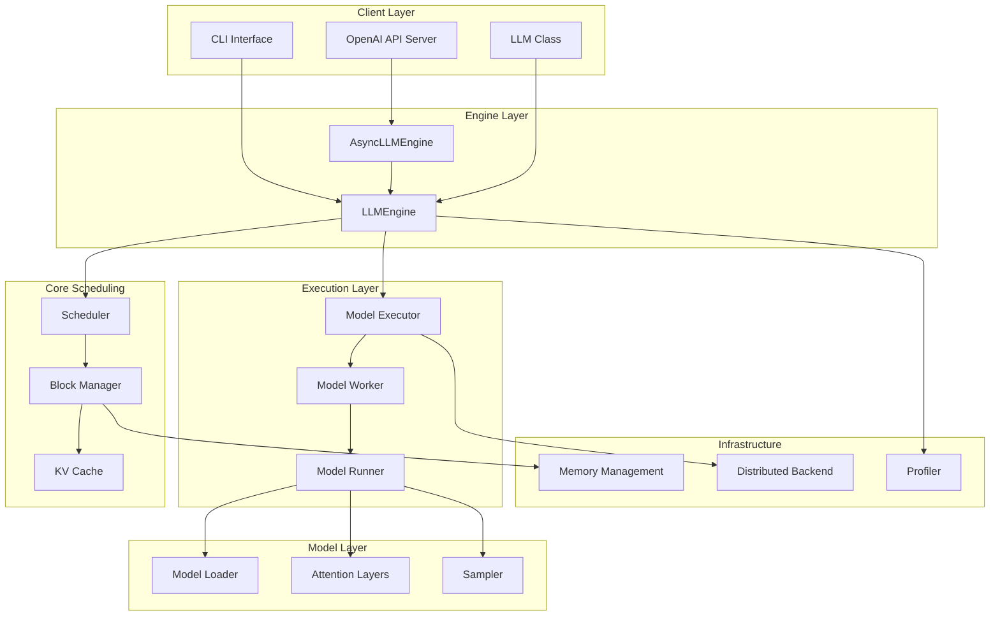
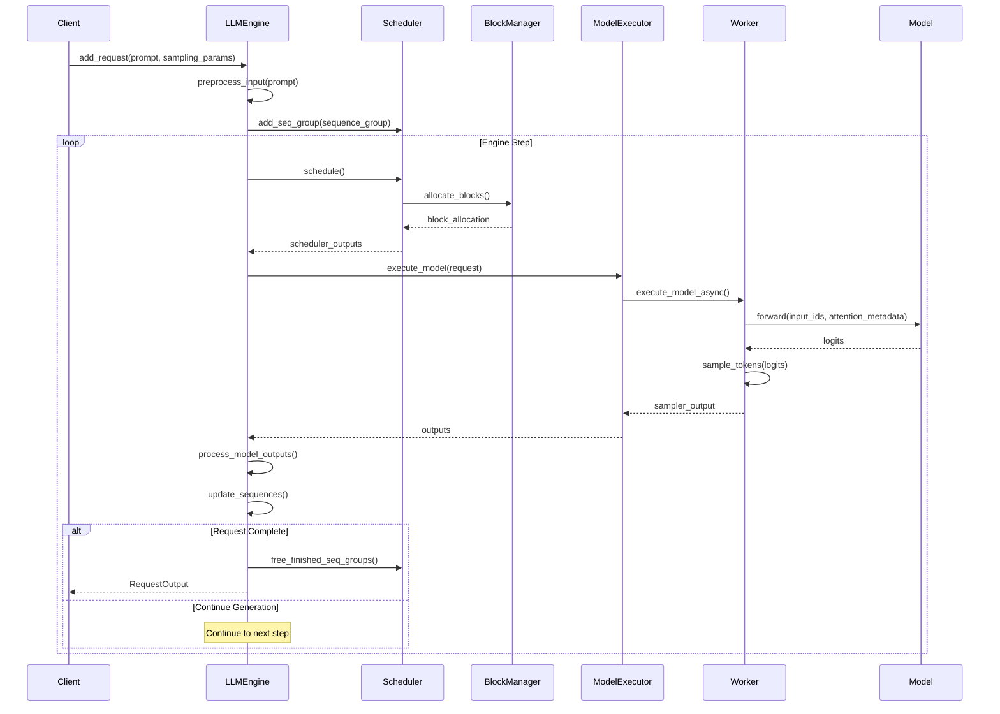
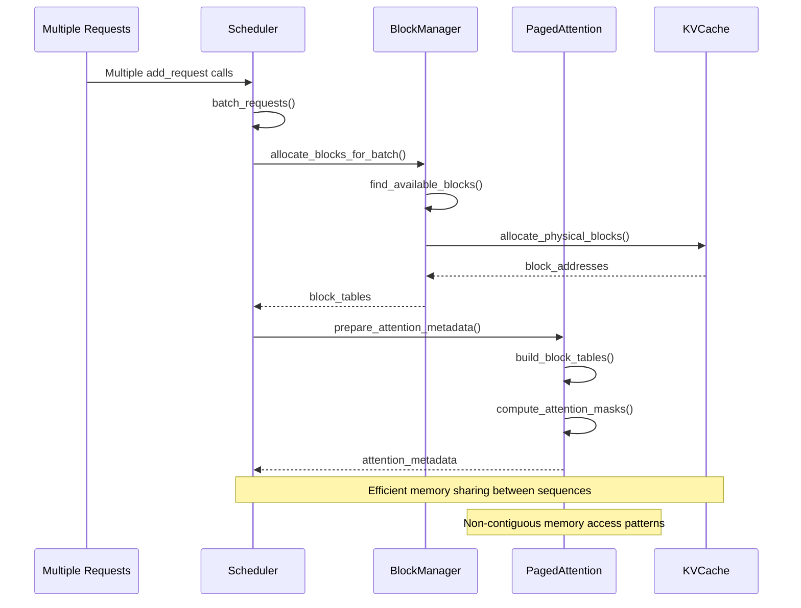
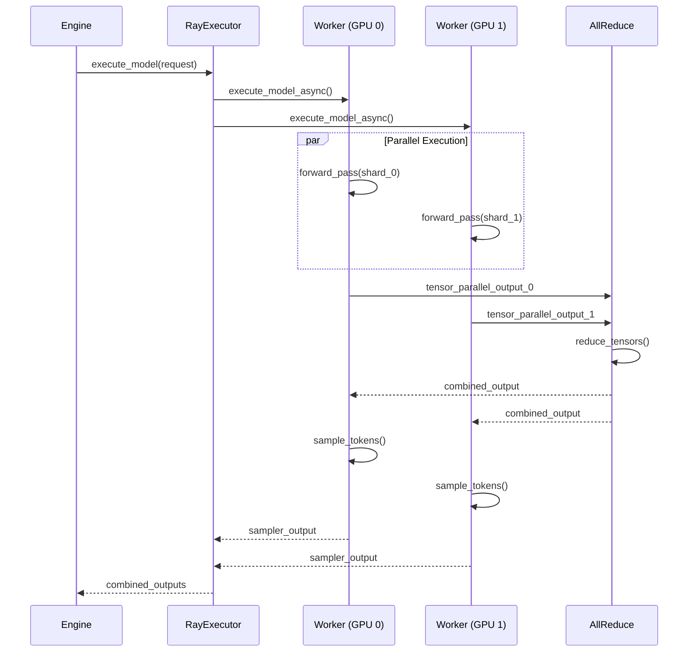

# vLLM Developer Onboarding Guide

## 1. 🧭 Overview

vLLM is a high-throughput and memory-efficient inference and serving engine for Large Language Models (LLMs). It was originally developed in the Sky Computing Lab at UC Berkeley and has evolved into a community-driven project with contributions from both academia and industry.

### Key Features
- **High-performance serving**: State-of-the-art serving throughput with efficient memory management
- **PagedAttention**: Revolutionary attention key-value memory management system
- **Continuous batching**: Dynamic batching of incoming requests for optimal resource utilization
- **Multi-modal support**: Support for text, vision, and audio models
- **Distributed inference**: Tensor parallelism and pipeline parallelism support
- **Quantization support**: GPTQ, AWQ, AutoRound, INT4, INT8, and FP8 quantizations
- **OpenAI-compatible API**: Drop-in replacement for OpenAI API servers
- **Speculative decoding**: Advanced decoding techniques for improved performance

### Technologies Used
- **Language**: Python 3.9-3.12
- **Deep Learning Framework**: PyTorch 2.7.0
- **Build System**: CMake, setuptools
- **Compute**: CUDA/HIP kernels, FlashAttention, FlashInfer
- **Distributed Computing**: Ray, multiprocessing
- **API Framework**: FastAPI (for OpenAI-compatible server)
- **Hardware Support**: NVIDIA GPUs, AMD CPUs/GPUs, Intel CPUs/GPUs, TPU, AWS Neuron

---

## 2. 🧱 High-Level Architecture Diagram



### Component Explanations
- **LLMEngine**: Core synchronous engine that orchestrates request processing and model execution
- **AsyncLLMEngine**: Asynchronous wrapper around LLMEngine for concurrent request handling
- **Scheduler**: Manages request queuing, batching, and resource allocation using sophisticated algorithms
- **Block Manager**: Handles memory allocation for KV cache using PagedAttention's block-based approach
- **Model Executor**: Coordinates distributed model execution across multiple workers/devices
- **Model Worker**: Individual worker process that runs model inference on specific devices
- **Attention Layers**: Optimized attention mechanisms including PagedAttention and FlashAttention
- **Sampler**: Handles token sampling with various decoding strategies (greedy, beam search, etc.)

---

## 3. 🔎 Component Breakdown

### Component: LLMEngine (`/data/users/yeq/gitrepos/vllm/vllm/engine/llm_engine.py`)

**Purpose**:
The core synchronous engine that receives requests, manages scheduling, and coordinates model execution. It's the heart of vLLM's inference pipeline.

**Key Elements**:
- `LLMEngine.__init__()`: Initializes all subsystems including scheduler, executor, and tokenizer
- `LLMEngine.step()`: Main execution loop that processes one iteration of inference
- `LLMEngine.add_request()`: Adds new requests to the processing queue
- `LLMEngine._process_model_outputs()`: Processes model outputs and creates response objects
- `SchedulerContext`: Manages output queues and request processing state
- `OutputData`: Container for model outputs and metadata

**Depends On**:
- Internal: `Scheduler`, `ModelExecutor`, `TokenizerGroup`, `InputPreprocessor`
- External: `torch`, `transformers`, `ray` (optional)

### Component: AsyncLLMEngine (`/data/users/yeq/gitrepos/vllm/vllm/engine/async_llm_engine.py`)

**Purpose**:
Asynchronous wrapper around LLMEngine that enables concurrent request handling and streaming responses for high-throughput serving.

**Key Elements**:
- `AsyncLLMEngine.generate()`: Async generator for streaming responses
- `AsyncLLMEngine.add_request()`: Async request addition with proper queuing
- `AsyncLLMEngine._engine_step()`: Background engine step execution
- `RequestTracker`: Manages async request state and completion

**Depends On**:
- Internal: `LLMEngine`, `AsyncEngineArgs`
- External: `asyncio`, `threading`

### Component: Scheduler (`/data/users/yeq/gitrepos/vllm/vllm/core/scheduler.py`)

**Purpose**:
Intelligent request scheduling system that manages queues, batching, preemption, and resource allocation to maximize throughput.

**Key Elements**:
- `Scheduler.schedule()`: Main scheduling algorithm that selects requests for execution
- `SchedulerOutputs`: Contains scheduled sequence groups and memory operations
- `ScheduledSequenceGroup`: Wrapper for sequence groups with scheduling metadata
- `_schedule_running()`: Manages currently executing requests
- `_schedule_swapped()`: Handles swapped-out requests
- `_schedule_waiting()`: Processes waiting queue

**Depends On**:
- Internal: `BlockSpaceManager`, `SequenceGroup`, `PolicyFactory`
- External: None (pure Python logic)

### Component: Block Manager (`/data/users/yeq/gitrepos/vllm/vllm/core/block_manager.py`)

**Purpose**:
Implements PagedAttention's revolutionary block-based memory management for KV cache, enabling efficient memory utilization and sharing.

**Key Elements**:
- `BlockSpaceManager`: Main interface for block allocation and management
- `BlockAllocator`: Handles physical block allocation on GPU/CPU
- `BlockTable`: Maps logical blocks to physical blocks for each sequence
- `PrefixCachingBlockAllocator`: Optimized allocator with prefix caching support

**Depends On**:
- Internal: `Block`, `Device`, `CacheConfig`
- External: `torch` (for memory operations)

### Component: Model Executor (`/data/users/yeq/gitrepos/vllm/vllm/executor/`)

**Purpose**:
Coordinates distributed model execution across multiple workers, handling parallelism strategies and communication.

**Key Elements**:
- `ExecutorBase`: Abstract base class for all executors
- `GPUExecutor`: Single-GPU execution
- `RayDistributedExecutor`: Ray-based distributed execution
- `MultiprocessingDistributedExecutor`: Multiprocessing-based distribution
- `ExecuteModelRequest`: Request object for model execution

**Depends On**:
- Internal: `ModelWorker`, `VllmConfig`
- External: `ray`, `torch.distributed`, `multiprocessing`

### Component: Model Worker (`/data/users/yeq/gitrepos/vllm/vllm/worker/`)

**Purpose**:
Individual worker processes that run model inference on specific devices, handling model loading and execution.

**Key Elements**:
- `Worker`: Main worker class that manages model execution
- `ModelRunner`: Handles model forward passes and sampling
- `CUDAGraphRunner`: Optimized execution using CUDA graphs
- `ModelInputForGPU`: Input preparation for GPU execution

**Depends On**:
- Internal: `ModelLoader`, `AttentionBackend`, `SamplerOutput`
- External: `torch`, `transformers`, device-specific libraries

### Component: Attention System (`/data/users/yeq/gitrepos/vllm/vllm/attention/`)

**Purpose**:
Optimized attention mechanisms including PagedAttention, FlashAttention, and various backend implementations.

**Key Elements**:
- `AttentionMetadata`: Metadata for attention computation
- `PagedAttention`: Core paged attention implementation
- `FlashAttentionBackend`: FlashAttention integration
- `AttentionBackend`: Abstract backend interface

**Depends On**:
- Internal: `BlockTable`, `SequenceData`
- External: `flash-attn`, custom CUDA kernels

### Component: Tokenizer System (`/data/users/yeq/gitrepos/vllm/vllm/transformers_utils/`)

**Purpose**:
Handles tokenization, detokenization, and LoRA-aware tokenizer management for various model types.

**Key Elements**:
- `TokenizerGroup`: Manages multiple tokenizers for LoRA support
- `Detokenizer`: Handles token-to-text conversion with streaming support
- `AnyTokenizer`: Type alias for various tokenizer implementations

**Depends On**:
- Internal: `LoRARequest`, `ModelConfig`
- External: `transformers`, `tokenizers`

### Component: Multimodal System (`/data/users/yeq/gitrepos/vllm/vllm/multimodal/`)

**Purpose**:
Handles multimodal inputs (text, images, audio) with preprocessing and model-specific adaptations.

**Key Elements**:
- `MultiModalRegistry`: Central registry for multimodal processors
- `MultiModalProcessor`: Base class for modality-specific processing
- `ImageProcessor`: Handles image inputs for vision-language models
- `AudioProcessor`: Handles audio inputs for speech models

**Depends On**:
- Internal: `ModelConfig`, `InputPreprocessor`
- External: `PIL`, `librosa`, `torch`

---

## 4. 🔁 Data Flow & Call Flow Examples

### Example Flow: Text Generation Request

**Description**:
A typical text generation request flows from the client through the engine, scheduler, and model execution layers, with careful memory management and batching optimizations.

**Sequence Diagram**:



### Example Flow: Batch Processing with PagedAttention

**Description**:
Multiple requests are batched together and processed efficiently using PagedAttention's memory management system.

**Sequence Diagram**:



### Example Flow: Distributed Inference

**Description**:
Large models are distributed across multiple GPUs using tensor parallelism, with coordinated execution and communication.

**Sequence Diagram**:



### Example Flow: Streaming Response

**Description**:
Asynchronous streaming of generated tokens back to the client as they are produced, enabling real-time interaction.

**Sequence Diagram**:

```mermaid
sequenceDiagram
    participant Client
    participant AsyncEngine
    participant LLMEngine
    participant OutputProcessor

    Client->>AsyncEngine: generate(prompt, stream=True)
    AsyncEngine->>AsyncEngine: add_request_async()

    loop Streaming Generation
        AsyncEngine->>LLMEngine: step()
        LLMEngine->>OutputProcessor: process_outputs()
        OutputProcessor-->>LLMEngine: request_outputs
        LLMEngine-->>AsyncEngine: step_outputs

        alt New Token Generated
            AsyncEngine-->>Client: yield RequestOutput(delta)
        else Request Complete
            AsyncEngine-->>Client: yield RequestOutput(final)
            break
        end
    end
```

---

## 5. 🗃️ Data Models (Entities)

### Entity: SequenceGroup

- **Module**: `vllm.sequence`
- **Fields**:
  - `request_id: str` – unique identifier for the request
  - `seqs: List[Sequence]` – list of sequences (for beam search, n>1)
  - `arrival_time: float` – timestamp when request was received
  - `sampling_params: Optional[SamplingParams]` – generation parameters
  - `pooling_params: Optional[PoolingParams]` – pooling parameters for embeddings
  - `lora_request: Optional[LoRARequest]` – LoRA adapter specification
  - `encoder_seq: Optional[Sequence]` – encoder sequence for enc-dec models
  - `state: SequenceGroupState` – current execution state

- **Relations**:
  - One-to-many with `Sequence`
  - References `SamplingParams` or `PoolingParams`
  - May reference `LoRARequest`

- **Notes**:
  Represents a complete generation request that may contain multiple sequences for beam search or parallel sampling.

### Entity: Sequence

- **Module**: `vllm.sequence`
- **Fields**:
  - `seq_id: int` – unique sequence identifier
  - `inputs: SequenceData` – input tokens and metadata
  - `outputs: SequenceData` – generated tokens and metadata
  - `status: SequenceStatus` – current status (running, finished, etc.)
  - `block_size: int` – block size for memory allocation
  - `eos_token_id: int` – end-of-sequence token ID
  - `lora_request: Optional[LoRARequest]` – LoRA adapter for this sequence

- **Relations**:
  - Belongs to `SequenceGroup`
  - Contains `SequenceData` for inputs and outputs
  - References `LoRARequest` if using LoRA

- **Notes**:
  Individual sequence within a request, containing the actual token data and generation state.

### Entity: SamplingParams

- **Module**: `vllm.sampling_params`
- **Fields**:
  - `n: int` – number of sequences to generate
  - `temperature: float` – sampling temperature (0.0 = greedy)
  - `top_p: float` – nucleus sampling parameter
  - `top_k: int` – top-k sampling parameter
  - `max_tokens: int` – maximum tokens to generate
  - `stop: List[str]` – stop sequences
  - `logprobs: Optional[int]` – number of log probabilities to return
  - `use_beam_search: bool` – whether to use beam search
  - `guided_decoding: Optional[GuidedDecodingParams]` – structured generation

- **Relations**:
  - Used by `SequenceGroup`
  - May contain `GuidedDecodingParams`

- **Notes**:
  Controls the generation behavior and sampling strategy for text generation requests.

### Entity: BlockTable

- **Module**: `vllm.core.block.block_table`
- **Fields**:
  - `blocks: List[Block]` – list of allocated blocks
  - `block_size: int` – tokens per block
  - `block_ids: List[int]` – physical block identifiers

- **Relations**:
  - Contains multiple `Block` objects
  - Belongs to a `Sequence`
  - Managed by `BlockSpaceManager`

- **Notes**:
  Maps logical token positions to physical memory blocks in the KV cache, enabling PagedAttention.

### Entity: Block

- **Module**: `vllm.core.block.common`
- **Fields**:
  - `block_id: int` – unique block identifier
  - `block_size: int` – number of tokens in block
  - `ref_count: int` – reference count for sharing
  - `device: Device` – GPU or CPU device
  - `computed: bool` – whether block contains computed KV cache

- **Relations**:
  - Belongs to `BlockTable`
  - May be shared across multiple sequences (prefix caching)

- **Notes**:
  Physical memory block that stores KV cache data, fundamental unit of PagedAttention memory management.

### Entity: SchedulerOutputs

- **Module**: `vllm.core.scheduler`
- **Fields**:
  - `scheduled_seq_groups: List[ScheduledSequenceGroup]` – sequences to execute
  - `num_batched_tokens: int` – total tokens in batch
  - `blocks_to_swap_in: List[Tuple[int, int]]` – CPU to GPU block swaps
  - `blocks_to_swap_out: List[Tuple[int, int]]` – GPU to CPU block swaps
  - `blocks_to_copy: List[Tuple[int, int]]` – block copy operations
  - `ignored_seq_groups: List[SequenceGroup]` – sequences not scheduled
  - `num_lookahead_slots: int` – slots for speculative decoding

- **Relations**:
  - Contains `ScheduledSequenceGroup` objects
  - References `SequenceGroup` objects

- **Notes**:
  Output of the scheduler containing all information needed for model execution and memory management.

### Entity: RequestOutput

- **Module**: `vllm.outputs`
- **Fields**:
  - `request_id: str` – unique request identifier
  - `prompt: str` – original input prompt
  - `outputs: List[CompletionOutput]` – generated completions
  - `finished: bool` – whether generation is complete
  - `metrics: Optional[RequestMetrics]` – performance metrics

- **Relations**:
  - Contains `CompletionOutput` objects
  - May contain `RequestMetrics`
  - Corresponds to original `SequenceGroup`

- **Notes**:
  Final output returned to clients, containing generated text and metadata.

### Entity: ModelConfig

- **Module**: `vllm.config`
- **Fields**:
  - `model: str` – model name or path
  - `dtype: torch.dtype` – model data type
  - `max_model_len: int` – maximum sequence length
  - `quantization: Optional[str]` – quantization method
  - `enforce_eager: bool` – disable CUDA graphs
  - `max_logprobs: int` – maximum log probabilities
  - `runner_type: str` – model runner type (generation/pooling)

- **Relations**:
  - Used by all model-related components
  - References quantization configurations

- **Notes**:
  Central configuration object that defines model behavior and capabilities throughout the system.
